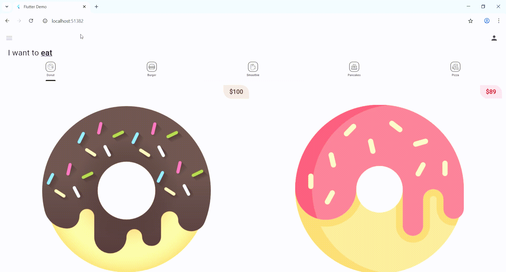

# donnut_app_8sc

A new Flutter project.

## Getting Started

This project is a starting point for a Flutter application.

A few resources to get you started if this is your first Flutter project:

- [Lab: Write your first Flutter app](https://docs.flutter.dev/get-started/codelab)
- [Cookbook: Useful Flutter samples](https://docs.flutter.dev/cookbook)

For help getting started with Flutter development, view the
[online documentation](https://docs.flutter.dev/), which offers tutorials,
samples, guidance on mobile development, and a full API reference.

# 🍩 Donut App – Flutter UI Project

A **Flutter-based mobile application** inspired by a **Dribbble design**, developed as part of the course **Mobile Application Programming** at the **Instituto Tecnológico de Mérida**.  
This app displays multiple categories of food (Donuts, Burgers, Smoothies, Pancakes, Pizza) using a **TabBar navigation** system and **custom widgets** for each product.

---

## 🚀 Features Overview
- 🧭 **Tabbed navigation** with categories for each product type.  
- 🍩 **DonutTile widget** displays each donut’s flavor, price, image, and provider.  
- ❤️ Favorite and **Add to Cart** interactive buttons.  
- 🧁 Clean UI based on the original Dribbble design.  
- 📱 Fully responsive layout using Flutter’s **Material Design** components.  

---

## 🧩 Main Widgets
| Widget | Description |
|---------|--------------|
| **HomePage** | Main screen that displays the app bar, category tabs, and their content. |
| **MyTab** | Custom widget that defines each tab’s icon and label. |
| **DonutTab** | Widget that displays the list/grid of donut products. |
| **DonutTile** | Custom card-like widget that shows the product image, name, provider, and buttons. |

---

## 🛠️ Technologies Used
- **Flutter** 🧠 – Front-end framework  
- **Dart** 💻 – Programming language  
- **Material Design** 🎨 – UI design system  
- **Dribbble** 🖌️ – Original visual design inspiration  

---

## 📂 Project Structure
```text

lib/
 ├── main.dart              # Entry point of the application
 ├── screens/
 │    └── home_page.dart    # Home screen and tab controller
 ├── tab/
 │    ├── donut_tab.dart    # Donut tab layout
 │    ├── burger_tab.dart
 │    ├── pizza_tab.dart
 │    ├── pancake_tab.dart
 │    └── smoothie_tab.dart
 ├── utils/
 │    ├── my_tab.dart       # Custom widget for category tabs
 │    └── donut_tile.dart   # Widget for displaying donut cards
 ├── icons/                 # Icon assets used for the category tabs
 └── images/                # Image assets for donut visuals

```

---

## 🎥 Demo
A short GIF showing the full app interaction: navigation between tabs, donut listings, and visual layout.



---

## 🎨 Design Credit
Original design by **Dstudio** on Dribbble:  
👉 [Donut App Design on Dribbble](https://dribbble.com/shots/19649140-App-UI)

Adapted and implemented by **Leonardo Yeret Ortiz Valle** as part of a Flutter learning project.

---

## 📘 Course Information
- **Subject:** Mobile Application Programming  
- **Teacher:** Rodrigo Fidel Gaxiola Sosa  
- **Institution:** Instituto Tecnológico de Mérida  
- **Group:** 8SC — October 2025  

---

✅ *“Building this app helped me understand Flutter widget composition, state management, and UI structure. Recreating a Dribbble design was a fun and valuable learning experience!”*  

